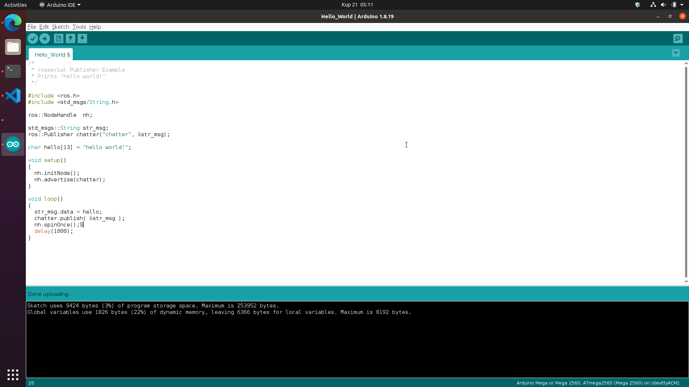

# Notas sobre *rosserial_arduino*
## Requisitos
- Tarjeta Gráfica NVidia de preferencia (Para la ejecución de Gazebo).
- Ubuntu 20.04 (Al menos hasta el 2025, después le toca a otro actualizar todo esto).
- Una buena cantidad de espacio entre _root_ y _home_. (En mi caso tengo 60Gb en cada uno).
- Conocimientos en Git, C++ y Python. (Mínimo, indispensable)
- Conocimientos en ROS. (No es tan necesario, pero si no sabes nada, te vas a perder un poco en este tutorial)
- Inglés intermedio o un buen traductor :v ([Deepl](https://www.deepl.com/es/translator))
## Instalando ROS Noetic
Debido a problemas haremos uso de dos guías:
1. [Configuración del repositorio: Pasos del 1 al 3.](https://linuxopsys.com/topics/install-ros-noetic-on-ubuntu)
2. [Instalación de todos los paquetes: Pasos del 1.4 al 1.6.1.](http://wiki.ros.org/noetic/Installation/Ubuntu)

Se recomienda encarecidamente leer bien lo que nos explican en ambas guías para no cometer errores en la instalación.  
Para verificar la instalación, ejecutamos en una terminal:
```
gazebo
```
El cual debería corrernos fácilmente a 60 fps.

## Instalando Arduino IDE 1.8.19
```
sudo snap install arduino
arduino
```
Nos saldrá un cuadro, que en resumen nos dirá que debemos ejecutar el siguiente código:
```
sudo usermod -a -G dialout <Tu_username>
```
Ejecutamos este comando y reiniciamos nuestro Ubuntu.  
Para asegurarnos de que está todo bien, subimos un código a algún Arduino que tengamos tirado por ahí (Debería subirse para que esté todo correcto).
## Instalando rosserial
Basándonos en la [documentación oficial](http://wiki.ros.org/rosserial_arduino/Tutorials/Arduino%20IDE%20Setup).  
Nos aseguramos de tener Arduino cerrado para no tener problemas y empezamos.  
Instalamos los paquetes necesarios para _ROS Noetic_.
```
sudo apt-get install ros-noetic-rosserial-arduino
sudo apt-get install ros-noetic-rosserial
```

Hacemos un terrible _change directory_ y ejecutamos algunos comandos para poder usar _rosserial_:
```
cd snap/arduino/85/Arduino # Por defecto para instalación de snap
cd libraries/
rm -rf ros_lib # Para asegurarnos de no tener una instalación anterior
rosrun rosserial_arduino make_libraries.py . # Darse cuenta de que el punto indica el directorio actual
```
Si está todo bien, abrimos Arduino y en la parte de _Examples_ abajo del todo debería salirnos _ros_lib_, seleccionamos _Hello_World_ (De los ejemplos o de este mismo Github).



## Probando el código
Sercioramos el tener seleccionada la placa y puerto correctos y procedemos a subir el código.  
Como trabajaremos con ROS, es recomendable usar el comando _Ctrl+Alt+T_ en una terminal para tener varias pestañas de distintas terminales en una sola ventana.  
Primera terminal:
```
roscore
```
Segunda terminal:
```
rostopic list
```
Nos brinda la siguiente salida:
```
/rosout
/rosout_agg
```

Entonces, para obtener los tópicos que hemos creado en nuestro Arduino, debemos ejecutar siempre:
Segunda terminal:
```
rosrun rosserial_python serial_node.py <Serial_Port>
```
Tercera terminal:
```
rostopic list
```
Nos brinda la siguiente salida:
```
/chatter
/diagnostics
/rosout
/rosout_agg
```
En la misma terminal hacemos:
```
rostopic echo /chatter
```


